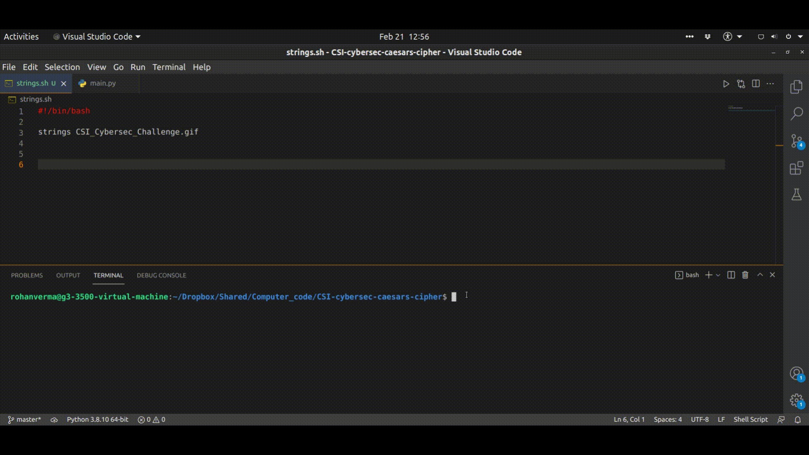

# Decrypting Caesar's Cipher

This project uses brute force method to find all possibilities of the decoded text using the encoded string provided as input.

## Stegnography

Stegnography is the technique of hiding a file or a message within another file.

I used the `strings` tool which is natively available in linux,  as demonstrated in the executable shell script `strings.sh`, in order to find the flag similar to the format: 
```
CSI{XXXX_XXXX} 
```
`strings` displays all the printable strings present in a given file. <br>
This tool is available by default in linux and requires no installation.

I found one string which looked somewhat similar to the flag.
```
SIY{s0dWh@jp_gJf1u}
```
On passing this string into `main.py` as an input, the 10th decrypted string matched the given format: 
```
CSI{c0nGr@tz_qTp1e}
```

## Demo




